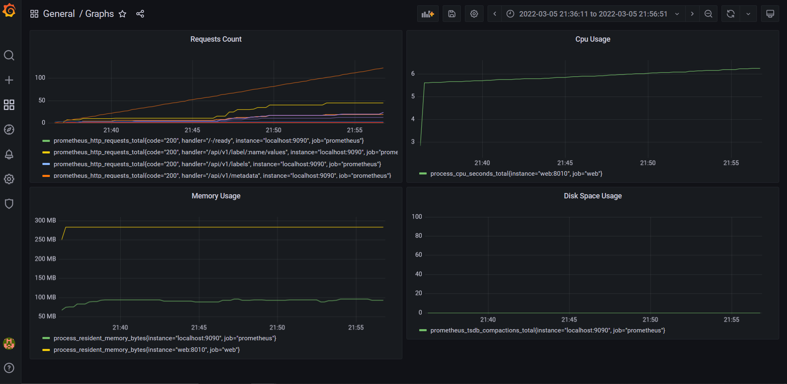

# Data Engineering Project : Sentiment Analysis Application - Nicolas KOURLUKOFF, Arnaud PIGNEROL, Gabriel THIBAUD

## Link to the Trello
### Trello link : https://trello.com/b/HUO4qf0t/dataengineering

<br/>

## This was done on a Windows environment, some modifications may need to be done if you using a Mac or Linux environment.
## If you are not using an admin session, all your terminal and docker shall be opened with administrator rights.
## The auth_password in the alert.yml have to be replace by your key (obtained from your google settings).

<br/>

## Run the docker image

### To run our image, you will have to open a terminal and run this command line:
```cmd
docker run -p 5000:5000 trahern/app:data_engineering_web
```

### If this command line doesn't work, try to login using the following line:
```cmd
docker login
```

### Then you will have to go to your [localhost](http://localhost:5000) to get on the webapp.
<br/>

## Building the container locally
### If you prefer to have the project built locally, you can use:
```cmd
docker build -t "data-engineering-project" .
```

### It will run the tests and create the web app on the [localhost](http://localhost:5000)
Then you'll juste have to run the command line :
```cmd
docker run -p 5000:5000 data-engineering-project
```

### Or you can clone the [git](https://github.com/Tr4hern/Data_Engineering/tree/dev), go to the place where you saved it using your terminal and do:
```cmd
docker-compose up
```

<br/>

## Running the tests alone

### If you want to only run the tests, you may need to get the project locally (check the previous part).
### When you have it, go to the place where you saved (you need to be in the "work" directory) it using your terminal and run the command line:
```cmd
pytest ./unit_tests.py
pytest ./integration_tests.py
pytest ./functionnal_tests.py
pytest ./end-to-end_tests.py
```
### You may need to install some python libraries, using:
```cmd
pip install -r requirements.txt
```
### For the different ports, we have :
- #### [5000](http://localhost:5000) for the app
- #### [8080](http://localhost:8080) for Jenkins
- #### [9090](http://localhost:9090) for Prometheus
- #### [8010](http://localhost:8010) for the metrics of Prometheus
- #### [3000](http://localhost:3000) for Grafana
<br/>

## Doing the graphs on Grafana
<br/>

### To do some graphs, we need the app and prometheus to be run. Then, we go to the [localhost](http://localhost:3000) assigned to Grafana and connect to it (put "admin" as the ID and the password).
### When you are connected, the first thing you need to do is to link Graphana to Prometheus. To do it, we need to go to "Add your first data source" on the home page. Then select Prometheus, its [url](http://localhost:9090), select "Browser" as the access and click on the button "Save & test" at the bottom of the page. If everything worked, a message stating the data source is linked should appear.
### Now we have our data, we can make some graphs. We shall return to the home page and click on "Create your first dashboard", then on "Add a new panel". We can now choose the metric we want to monitor and on which job. To do that, we have to click on "Metrics browser" on the left bottom, select the metric we want to monitor in the 1st part, keep "job" selected in the second part and choose which job in the third. In our case, we will take the web job by priority, and if it is not avaiblable we will take the Prometheus one. Finally, we click on the "Use query" button and a graph should appear. We can change some information, like the title, the axis or the units on the right part.
### We can make multiple graphs on a dashboard to be able to monitor different metrics at the same time.

<br/>

### The different metrics to monitor on grafana are :
- #### process_cpu_seconds_total for cpu usage
- #### process_resident_memory_bytes for memory usage
- #### prometheus_tsdb_compactions_total for disk space usage
- #### prometheus_http_requests_total for requests count
<br/>

### Which gives us these graphs :
